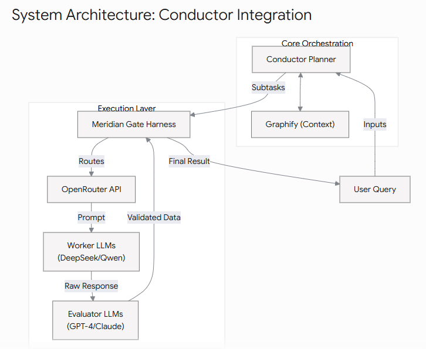

> **ℹ HISTORICAL (origin conversation).** This is the Gemini brainstorm that seeded
> Ariadne. Several of its assumptions have since been revised by experiment — notably
> "cost-efficient" became "capability amplifier," and the trained Conductor/TRINITY
> router proved unnecessary for v1. Read alongside [docs/FINDINGS.md](docs/FINDINGS.md)
> (what changed and why) and [docs/ARCHITECTURE.md](docs/ARCHITECTURE.md) (current plan).

## Brain Storming Ideas for Build of Ariadne

Below are prompts and responses in a chat that evolved to a software build idea that will serve as a baseline in this design phase. 

**PROMPT 1**

Cursor, Copilot, Jules, Codex, Cline and many more all using some or many versions of context engineering or harness engineering and the academic ideas like MaPLe, CoOP, DECOMP, ProTeGi are all being used in a variety of ways and approaches. Give me a current detailed understanding of the current state of this space, who the players are, what the similarities and differences are, etc. 

**RESPONSE 1**

The AI coding assistant landscape has fundamentally shifted. We are no longer in the era of raw autocomplete or simple "chatbots" that guess the next line of code. The current state of the art is defined by **Agentic Context Engineering** and **Harness Engineering**—the practice of meticulously shaping the environment, constraints, and operational loops an AI operates within before it ever generates a token.

Here is a detailed breakdown of the current space, how academic theories are actively powering these tools, and how the major players differ.

---

### The Academic DNA: From Papers to Production

The buzzwords you are seeing—MaPLe, CoOP, DECOMP, ProTeGi—are not just theoretical; their underlying philosophies are being productized into the "harnesses" that run coding agents.

* **DECOMP (Decomposed Prompting):** This is the backbone of modern "Plan Mode" or agentic workflows. DECOMP theorizes that LLMs fail at complex logic but excel when a master task is broken into a hierarchical cascade of sub-tasks with specialized handlers. In tools like Cline or Cursor's Composer, you aren't sending one massive prompt. The harness applies DECOMP by splitting your request into: `f1(grep codebase)` -> `f2(read dependencies)` -> `f3(draft implementation plan)` -> `f4(execute)`.
* **ProTeGi (Prompt Optimization via Textual Gradients):** ProTeGi treats natural language critiques like numerical gradients in machine learning. If an agent writes code that fails a test, the error trace and linter output act as a "textual gradient." The harness reads this feedback, updates the system prompt or local context, and re-triggers the LLM. This is the exact mechanism powering the "auto-healing" loops in tools like Aider.
* **MaPLe (Multi-scale Attribute-enhanced Prompt Learning):** Originally developed for Vision-Language models to understand both "entity-level" (micro) and "slide-level" (macro) data, this hierarchical concept is heavily utilized in codebase RAG (Retrieval-Augmented Generation). Coding assistants use a MaPLe-like architecture to simultaneously inject micro-context (the specific function you are editing) and macro-context (your `.cursorrules` file detailing project architecture) without confusing the model.
* **CoOP (Context Optimization):** Focused on tuning continuous prompt embeddings, CoOP's influence is seen in how advanced AI coding harnesses dynamically weight and retrieve codebase chunks. Instead of just dumping files into the context window, the system optimizes *which* context matters most right now to prevent context dilution.

---

### The Players: Archetypes and Approaches

The market is currently divided into three distinct architectural approaches, each with different philosophies on transparency, integration, and context management.

| Tool / Player | Ecosystem | Philosophy & Context Strategy |
| --- | --- | --- |
| **Cursor / Windsurf** | IDE-Native (Forked VS Code) | **Frictionless & Opaque.** Deeply integrated into the editor. They manage context implicitly (reading open tabs, cursor position, and `.cursorrules`). They cap file reads to prevent context bloat, making them incredibly fast but sometimes limited on massive refactors. |
| **Cline / Roo Code** | VS Code Extensions | **Transparent & Autonomous.** These act as autonomous agents living inside your IDE. They have explicit access to read/write files and run terminal commands. Cline excels at context management by actively tracking token usage and summarizing long conversations to "reset" the context window without losing memory. |
| **Aider / Codex CLI** | Terminal-Native | **Developer-Mimicry.** These run in your terminal and interact with your code exactly like a human would—using `grep`, reading tests, and executing scripts. They rely heavily on explicit context files (like `AGENTS.md`) and are highly effective for CI/CD integrations. |
| **GitHub Copilot** | Enterprise Incumbent | **Broad & Safe.** Copilot has massive distribution and deep integration with GitHub's ecosystem. While historically focused on inline generation, its newer "Agent Mode" brings it closer to Cursor, though it often prioritizes enterprise safety and compliance over cutting-edge autonomy. |
| **Jules & Specialized Agents** | Custom/Internal | **Task-Specific.** Tools in this category often focus on highly specific segments of the software lifecycle, such as purely autonomous bug-bashing or PR reviews, relying heavily on DECOMP to break down massive repository issues into solvable chunks. |

---

### Similarities Across the Board

Despite UI differences, every serious player is converging on a few universal truths:

1. **The "Instruction Manual" Pattern:** Every tool now relies on static context files (`.cursorrules`, `CLAUDE.md`, `AGENTS.md`). You dictate the project structure, naming conventions, and build commands upfront so the AI doesn't waste tokens guessing your architecture.
2. **The "Plan Before Execute" Loop:** Raw generation is dead. The industry standard is now forcing the AI to output an implementation plan, allowing the human to review the logic, and only then permitting the agent to execute file modifications.
3. **Context Window Pragmatism:** Even with models supporting 1M+ tokens, simply dumping an entire codebase into the prompt degrades logic. All tools are utilizing strategic retrieval, summarization, and context-clearing mechanisms to keep the AI focused on the immediate task.

### The Key Difference: Transparency vs. Convenience

The dividing line in the current space is how much control the developer has over the *harness*.

Tools like **Cursor** hide the context engineering from you; they decide what context to send to the model behind the scenes to optimize for speed and user experience. Conversely, tools like **Cline** or **Aider** give you the raw levers. They show you exactly what files they are reading, how many tokens they are consuming, and allow you to manually step in if the DECOMP loop goes off the rails.

Ultimately, the space has matured from asking *"How good is the underlying model?"* to *"How efficiently does the tooling harness the model's logic while managing its working memory?"*

**PROMPT 2**

What are the differences in the model architectures, training, infrastructures, etc between different leading frontier lab LLMs like Claude Sonnet 4.8, Gemini 3.1 Pro, GPT 5.5, GLM 5.2, DeepSeek V4 Pro, Qwen 3.7 Max. Will different context engineering approaches yield different results? Why?

**RESPONSE 2**

The 2026 frontier model landscape has fundamentally fractured into distinct architectural philosophies. We are no longer just scaling up parameters; labs are actively re-engineering how models handle attention, compute reasoning, and process multi-step agentic loops to make massive 1-million-token contexts economically and computationally viable.

Here is a breakdown of how the current state of the art models are built, trained, and why your context engineering harness must adapt to their specific architectures.

---

## Architecture & Infrastructure

To escape the $\mathcal{O}(N^2)$ compute cost of standard attention across 1M tokens, labs have heavily specialized their inference engines.

| Model | Architecture & Scale | Context | Defining Mechanism |
| --- | --- | --- | --- |
| **DeepSeek V4 Pro** | MoE (1.6T total, 49B active) | 1M | **Hybrid Attention:** Combines Compressed Sparse Attention (CSA) and Heavily Compressed Attention (HCA). |
| **GLM-5.2 (Zhipu)** | Sparse MoE (~750B total, 40B active) | 1M | **IndexShare:** Reuses the same indexer across every four sparse attention layers. |
| **Claude Opus 4.8** | Highly-tuned MoE/Dense Hybrid | 1M | **Adaptive Thinking:** Natively defaults to high-effort reasoning with mid-conversation system message caching. |
| **GPT-5.5** | Deep Agentic Architecture | 400k | **Deep Orchestration:** Tuned specifically for autonomous, multi-step software and research workflows. |
| **Qwen 3.7 Series** | Multimodal Hybrid Agent | 1M | **Native UI/CLI:** Operates GUI and CLI simultaneously without needing external OCR scaffolding. |
| **Gemini 3.1 Pro** | Native Multimodal | 1M+ | **Deep Logic Integration:** Verified 77.1% on ARC-AGI-2, blurring text and pixel reasoning. |

### The Sparsity Divide

Open-weight titans like **DeepSeek V4** and **GLM-5.2** rely on aggressive sparse attention. By using mechanisms like CSA and IndexShare, they cut single-token inference FLOPs by ~70% compared to previous generations. They only activate a fraction of their parameters (e.g., DeepSeek routing to 49B out of 1.6T) per token. Conversely, proprietary models like **Claude Opus 4.8** and **GPT-5.5** lean into massive, robust KV-cache infrastructure to maintain perfect recall over long logic chains, accepting higher base infrastructure costs in exchange for out-of-the-box reliability on massive codebases.

## Training & Post-Training Pipelines

The era of simple RLHF (Reinforcement Learning from Human Feedback) is over. The frontier now relies on multi-stage post-training:

1. **Independent Domain Cultivation:** Models like DeepSeek V4 undergo a two-stage paradigm. First, domain-specific "experts" are cultivated independently using Supervised Fine-Tuning (SFT) and Group Relative Policy Optimization (GRPO).
2. **On-Policy Distillation:** Those independent experts are then consolidated into the unified model via distillation, ensuring the model doesn't suffer from "catastrophic forgetting" when switching between Python code and legal analysis.
3. **Exposed Reasoning Budgets:** Models are no longer static inference engines. GLM-5.2, DeepSeek V4, and Claude 4.8 all expose explicit "reasoning effort" APIs. You are actively allocating inference compute at runtime—DeepSeek allows toggling between *Non-think*, *Think High*, and *Think Max*.

---

## Will Different Context Engineering Yield Different Results?

**Absolutely.** Because the underlying attention mechanisms and cache geometries differ so wildly, a monolithic DECOMP or MaPLe harness that works perfectly on GPT-5.5 will likely degrade on GLM-5.2. Here is why:

### 1. Sparse Attention Penalizes Fragmented Context

When building a context harness for DeepSeek V4 or GLM-5.2, you cannot scatter dependencies randomly across a 1M-token prompt. Because they utilize sparse attention (IndexShare, CSA), highly fragmented data forces the sparse indexer to jump constantly, risking dropped logic.

* **The Fix:** You must group related context contiguously. Place a module's interface, implementation, and tests in a single block rather than concatenating files alphabetically.

### 2. Cache Geometry Requires Static Prefixes

Claude Opus 4.8 introduced a vital feature for context engineering: **mid-conversation system messages**. If your agentic loop continuously restates the main system prompt or prepends new state to the *top* of the prompt, you destroy the KV-cache, massively inflating your Time to First Token (TTFT) and API costs.

* **The Fix:** Harnesses optimized for Claude 4.8 build a "static prefix"—loading the entire `.cursorrules` and codebase architecture once—and then append new sub-tasks and system adjustments to the *bottom* of the array.

### 3. Spatial Context over Textual Context

If you are using Qwen 3.7 or Gemini 3.1 Pro, context engineering is no longer limited to text. Because these are multimodal hybrid agents, providing a UI screenshot directly in the context window allows the model to map pixels directly to DOM nodes. Translating visual state into text (like using a library to dump an HTML DOM tree into the prompt) is actually a regression for these models and will lower your benchmark scores.

**PROMPT 3**

Where does a tool like Graphify, https://github.com/PCSchmidt/graphify, fit into this picture. Will Graphify work with all the LLMs we're discussing. What differences? 

**RESPONSE 3**

I have an idea for an application that uses the ideas from the TRINITY paper and the Conductor paper where the app has an api key to a multi model provider like OpenRouter and can select from some preselection of top performing LLMs like GPT-5.4, GLM-5.2, Qwen-3.7, DeepSeek V4 Pro, etc. using the Conductor to route the prompt or requests to the optimal model. The idea is similar to what https://sakana.ai/fugu/ is doing. 

C:\Users\pchri\Documents\JHUAIEngineering\705.608-Applied_Generative_AI\Modules\Module6\Mod6Readings\TRINITY_an_Evolved_Coordinator.pdf

C:\Users\pchri\Documents\JHUAIEngineering\705.608-Applied_Generative_AI\Modules\Module6\Mod6Readings\LearningToOrchestrateAgentsWithConductor.pdf

**RESPONSE 3**

Your idea of building an orchestration application leveraging OpenRouter to dynamically route tasks across frontier models aligns exactly with the cutting edge of test-time scaling and collective intelligence. Sakana AI’s research with **TRINITY** and **Conductor** provides the perfect architectural blueprint for this exact system.

By synthesizing these two paradigms, you move away from static, human-engineered agent pipelines (like standard LangChain or crewAI loops) and move toward a system where a small, hyper-specialized controller model dynamically generates custom execution topologies on the fly.

---

## Architectural Synthesis: TRINITY vs. Conductor

To build this app, you first need to decide on the underlying control mechanism for your router layer. The two papers approach the "orchestrator" role with fundamentally different engineering philosophies:

### 1. The TRINITY Approach: State-Machine Routing

* **How it works:** TRINITY utilizes a very small Small Language Model (SLM, e.g., Qwen3-0.6B) stripped of its standard text generation layer. Instead, a lightweight linear head ($\approx$10K parameters) reads the internal hidden states of the penultimate token of the prompt. It outputs discrete classification logits that select an **LLM ID** and assign it a fixed role: **Thinker** (planning), **Worker** (executing), or **Verifier** (evaluating).


* **Optimization:** It uses a derivative-free evolutionary strategy (**sep-CMA-ES**) to train the tiny head based on whether the multi-turn conversation eventually reaches a correct final answer.


* **Pro:** Blazing fast execution and near-zero token costs for the orchestrator layer.


### 2. The Conductor Approach: Generative Prompt-Engineering

* **How it works:** Rather than treating routing as a classification problem, Conductor uses a larger model (e.g., a 7B LLM) to reason natively in natural language. The Conductor reads the user query and generates a chain-of-thought, followed by structured arrays mapping out the exact subtasks, model routing, and communication visibility:


```python
model_id = [2, 0, 1]
subtasks = ["Decompose this complex math proof...", "Execute the code...", "Verify formatting..."]
access_list = [[], ["all"], [0, 1]] # Determines which model sees prior outputs

```


* **Optimization:** It is trained end-to-end using reinforcement learning (**GRPO**) to maximize downstream verification rewards.


* **Pro:** Absolute specification freedom. The controller actively prompt-engineers the worker models, matching the instruction nuance to the target model’s known specialties.


---

## Designing Your App's Core Engine

For a cross-provider OpenRouter application, a **hybrid Conductor-style approach** is highly recommended. Because you are wrapping closed-source APIs with variable latencies, a generative controller that handles custom prompt synthesis yields massive performance compounding.

### Execution Loop Blueprint

```
[User Query] ──> [7B Conductor Controller (Local/Inexpensive API)]
                        │
                        ├──> Generates: subtasks[], model_ids[], access_lists[]
                        │
                        └──> [OpenRouter Routing Orchestrator]
                                    │
                                    ├───> Step 1: Qwen 3.7 Max (Thinker/Planner)
                                    │        │ (Fed via access_list)
                                    │        ▼
                                    ├───> Step 2: DeepSeek V4 Pro (Heavy Worker)
                                    │        │ (Fed via access_list)
                                    │        ▼
                                    └───> Step 3: GPT-5.4 (Verifier/Refiner)
                                             │
                                             ▼
                                      [Final Output]

```

### Strategic Mapping for Your Frontier Model Pool

Your application's router can exploit the precise post-training biases and architectural configurations of the 2026 frontier models:

* **The Planners (The "Thinkers"):** Models like **Gemini 2.5/3.1 Pro** excel at global contextual awareness and macro-strategy definition. Your Conductor should route initial architecture/decomposition tasks here.


* **The Crunchers (The "Workers"):** **DeepSeek V4 Pro** and **Qwen 3.7 Max** boast highly optimized execution capabilities for code generation, heavy math synthesis, and granular step-by-step logic expansion.


* **The Refiners (The "Verifiers"):** Models like **GPT-5.4** exhibit exceptional strictness in constraint satisfaction, formatting compliance, and multi-perspective verification. They act as the perfect anchor step to validate the work of the previous models before serving it to the user.


---

## Advanced Extension: Recursive Test-Time Scaling

If your application adopts the Conductor paradigm, you can unlock a unique feature highlighted in the paper: **Recursive Topologies**.

By adding your controller's own deployment endpoint into the available `model_id` pool, the Conductor can conditionally delegate tasks *to itself*. If a worker model returns an output that looks structurally flawed or fails intermediate execution checks, the recursive Conductor reads the error state, overrides its initial strategy on-the-fly, and spawns a new evaluation branch using alternative models (e.g., swapping out an inference model for a dense reasoning model). This creates a completely dynamic, compute-adaptive test-time scaling axis tailored to the precise difficulty of the problem.

---

## Comparison to Sakana AI's Ecosystem

This architecture mirrors the core philosophy behind Sakana AI's internal projects like **Fugu**. Rather than trying to train an impossibly heavy, monolithic model to dominate every single evaluation metric, the emphasis shifts to **collective intelligence ecosystems**.

By building a specialized, lightweight meta-agent that is brilliant at identifying *which* model to deploy, *how* to break down a problem, and *how* to prompt the target model, your application can systematically outperform any single baseline frontier model at a highly optimized operational cost.

**PROMPT 4**

Would it make sense to include the ideas in https://github.com/PCSchmidt/meridian or in https://github.com/PCSchmidt/graphify to further enhance the performance and cost savings of the app for complex software development. 

**RESPONSE 4**

Integrating Meridian and Graphify into your Conductor-style orchestration application is not just a good idea—it directly solves the two most expensive failure modes of autonomous agents: **context dilution** and **hallucinated completion**.

While your Conductor layer handles the *routing* (deciding which LLM from OpenRouter gets which prompt), Graphify and Meridian handle the *environment*. Together, they convert a theoretical research concept into a production-grade software development engine.

Here is exactly how they drastically enhance performance and reduce API costs.

### 1. Graphify: The Token-Saving Context Layer

In a standard agent loop, a massive amount of OpenRouter API costs are wasted on "discovery"—the agent repeatedly running `ls`, `cat`, or `grep` to figure out how files connect, and often re-reading the same files across multiple steps.

Graphify replaces blind RAG with an **Ontological Knowledge Graph**.

* **Cost Savings:** Instead of injecting 100,000 tokens of raw code into Qwen-3.7 to let it figure out the project structure, you inject Graphify's `GRAPH_REPORT.md` and a highly compressed JSON map of the dependencies. The Conductor instantly knows which 3 specific files the Worker LLM needs to edit, reducing the prompt payload by orders of magnitude.
* **Performance:** Because Graphify pre-computes the relationships between code, docs, and schemas, the LLM avoids the "lost in the middle" context window problem, operating with perfect topological awareness.

### 2. Meridian: The Execution & Enforcement Scaffold

The Conductor paper proves that an LLM can plan a great sequence of subtasks. However, *long-running agents fail predictably*—they lose the plot halfway through, skip steps, and generously evaluate their own broken code. Meridian's architecture is the perfect execution harness for a multi-model router.

* **The Generator-Evaluator Split:** Meridian enforces a strict separation between the agent writing the code and the agent evaluating it. This perfectly maps to your OpenRouter pool. You can use Conductor to route the *Generator* role to DeepSeek V4 Pro (cheap, excellent at heavy coding) and route the *Evaluator* role to GPT-5.4 (stricter, higher reasoning capability). Meridian ensures the Generator cannot "praise its own work."
* **Enforced Gates (The DAG):** Instead of letting an agent run wild in an open loop, Meridian forces the LLMs through a Directed Acyclic Graph (DAG) of gates (e.g., `CONTRACT` -> `SPEC` -> `IMPLEMENTATION` -> `TESTS`). The Conductor only triggers the next OpenRouter call once Meridian mathematically verifies the current gate has been passed.
* **Cost Savings via Halting:** By using Meridian's validated memory and strict gate blocks, you prevent runaway agent loops. If an LLM fails a test 3 times, Meridian halts the execution rather than burning $5 on pointless retries.

### The Unified Architecture

When you combine all four concepts (Conductor Routing, OpenRouter API pool, Graphify Context, and Meridian Harness), you get a system that looks like this:



By utilizing Graphify to define the *state* of the world, Conductor to define the *strategy*, Meridian to enforce the *rules*, and OpenRouter to supply the *compute*, you are effectively building an enterprise-grade version of Sakana's Fugu tailored specifically for complex software and ML engineering.

How do you envision handling the state management for the Conductor's recursive topology (where it overrides its own strategy if an evaluator LLM rejects a proposed solution)?

**PROMPT 5**

That's a good question on how best to handle the state management for the Conductor's recursive topology - can you research and determine the valid options and the approach that doesn't contradict the goals of maximizing performance while being as efficient as possible with token usage?

**RESPONSE 5**

To manage the state of a recursive Conductor topology without detonating your token budget or degrading the model's reasoning through context bloat, you must abandon the standard "chat history" paradigm.

In a recursive loop (Plan $\rightarrow$ Execute $\rightarrow$ Fail $\rightarrow$ Re-Plan), appending every failed code block and stack trace to the prompt creates an $\mathcal{O}(N)$ token explosion. This not only drives up OpenRouter costs but also pushes the models past their effective reasoning horizons, leading to repetitive hallucinations.

Because you are integrating **Meridian** and **Graphify**, you already have the architectural primitives to solve this using **Differential State Management** combined with **Prompt Caching**. Here is the optimal approach.

### The Recommended Approach: Differential Memory Architecture

Instead of feeding the Conductor a raw transcript of everything that happened, you partition the state into three distinct, schema-validated tiers. This leverages Meridian's memory taxonomy and Graphify's ontological maps to keep the prompt payload flat and highly compressed.

#### 1. The Static Prefix (KV Cache Optimization)

To maximize performance and minimize cost, you must exploit the prompt caching mechanisms now standard across OpenRouter providers (e.g., Anthropic's Prompt Caching, DeepSeek's Context Caching). Caches only work if the *beginning* of the prompt remains perfectly static across recursive turns.

* **The Implementation:** At the very top of your Conductor prompt, place the invariant context. This includes the overarching System Prompt, the Meridian DAG rules (the gates), and Graphify's `GRAPH_REPORT.md` (the map of the project).
* **The Benefit:** If your static prefix is 80,000 tokens, you only pay the "cache miss" token cost on the *first* turn. Every recursive loop thereafter pays the massively discounted "cache hit" rate and executes with near-zero Time to First Token (TTFT).

#### 2. Working Memory (Pointer-Based State)

During the execution phase, the worker LLM (e.g., DeepSeek) will generate code. **Do not pass this raw code back to the Conductor.** The Conductor does not need to read 500 lines of failed Python to know it needs a new strategy.

* **The Implementation:** Use Graphify as a spatial pointer system. The Working Memory passed to the Conductor should only contain diff-pointers and execution statuses.
* **Example State Payload:** ```json
{
"current_gate": "IMPLEMENTATION",
"active_nodes": ["graph_node_auth.py", "graph_node_db_schema.sql"],
"last_action": "DeepSeek-V4 attempted to implement OAuth2",
"status": "FAILED_EVALUATION"
}
```


```


#### 3. Episodic Memory (The Reflexion Protocol)

This is the most critical step for recursive topologies. When the Evaluator LLM (e.g., GPT-5.4) rejects the Worker's output, it must not simply dump a massive error trace. You must use a "Reflexion" loop (a concept native to Meridian's architecture).

* **The Implementation:** Force the Evaluator LLM to output a highly compressed **Semantic Constraint** alongside its rejection. It translates the failure into a rule for the next attempt.
* **Example Compression:** Instead of passing back a 200-line traceback, the Evaluator writes: *"Reflexion: DeepSeek attempted to use synchronous SQLAlchemy sessions inside the async FastAPI route. Next attempt MUST use `AsyncSession` and `yield`."*
* **The Benefit:** You append this 30-token Reflexion to the Conductor's Episodic Memory ledger. When the Conductor recursively re-plans, it reads the ledger of constraints, preventing it from repeating the same mistake, without having to read the failed code itself.

---

### The Recursive Execution Loop (Token-Optimized)

When a failure occurs and the Conductor must invoke itself to generate a new `model_id` routing or subtask list, its prompt looks exactly like this:

```text
[STATIC PREFIX - CACHED]
- Goal: Implement Authentication
- Graphify Ontology Map (Dependencies)
- Meridian Gate Rules

[EPISODIC MEMORY - APPEND ONLY]
- Attempt 1: Failed. DeepSeek used sync database drivers.
- Attempt 2: Failed. Qwen-3.7 caused a circular import in `auth.py`.

[WORKING MEMORY - MUTABLE]
- Current state: `auth.py` is rolled back. 
- You are the Conductor. The previous topologies failed. 
- Task: Generate a new routing topology (subtasks, model_id, access_list) adhering to the constraints in Episodic Memory.

```

### Why this is the optimal path:

1. **Cost Efficiency:** By stripping out the failed code and tracebacks, the mutable portion of your prompt remains incredibly small (usually under 1,000 tokens per recursive loop). Combined with KV caching for the heavy Graphify context, your OpenRouter API costs drop exponentially.
2. **Performance & Reasoning:** LLMs are highly susceptible to "distraction" when fed massive context windows filled with broken code. By compressing failures into concise rules (Reflexion), the Conductor's attention mechanism remains laser-focused on the high-level strategy, drastically increasing the probability that its recursive re-plan will actually succeed.

**PROMPT 6**

The Differential Memory Architecture is a good idea. What other architectural decisions need to be made before consolidating these ideas into a build plan for the application?

**RESPONSE 6**

Before writing the first line of code, several structural and infrastructure decisions must be finalized to ensure the system is resilient, secure, and cost-effective. Fusing Conductor's recursive topology with Meridian's execution DAG and Graphify's spatial maps creates a highly capable system, but it requires precise orchestration at the API and data layers.

Here are the key architectural decisions that need to be made:

### 1. OpenRouter Integration & Sticky Routing

To make the Differential Memory Architecture work efficiently, the underlying API routing must guarantee that the context cache stays hot across recursive agent loops.

* **Provider Sticky Routing:** OpenRouter supports session-based sticky routing. By passing a `session_id` (up to 256 characters) in your API calls, OpenRouter automatically routes subsequent requests in your multi-turn agentic workflow to the same provider endpoint. This is absolutely critical; without it, requests might be load-balanced to a different provider node, resulting in a cache miss and forcing you to pay to re-ingest the entire Graphify context. Sticky routing activates on any successful request when a `session_id` is present, allowing subsequent requests to benefit from caching immediately.
* **Server-Side Presets:** Hard-coding model slugs makes the application brittle. Instead, you should utilize OpenRouter's server-side presets. Presets allow you to define a fallback chain of models, provider rules, and parameters outside your codebase. If a specific provider restricts a model or it gets deprecated, the preset automatically routes to the next best option without requiring you to redeploy the application.

---

### 2. Caching Taxonomy and Cost Control

You must explicitly configure how your application handles different caching layers to prevent budget overruns during long-running software tasks.

* **Provider Prompt Caching:** This serves as the engine for your Static Prefix (the Graphify maps and Meridian rules). Depending on the model, this caching is either implicit (like DeepSeek, OpenAI, and Gemini 2.5) or explicit (like Anthropic, where you must set `cache_control` breakpoints). Anthropic models support explicit cache TTLs of either 5 minutes or 1 hour, allowing you to tune how long the context stays warm between Conductor invocations.
* **Response Caching:** OpenRouter also offers exact-match Response Caching, enabled via the `X-OpenRouter-Cache` header or within presets. If identical requests are sent (matching the API key, model, streaming mode, and request body hash), OpenRouter returns the response immediately from its own cache. This reports zero billable usage and drops latency significantly. This is highly useful for repeating deterministic planning tasks or running automated regression tests.

---

### 3. Data Governance and Zero Data Retention (ZDR)

Because this application will process complex, proprietary software architectures, data governance and security parameters must be established early.

* **Implicit Caching vs. Retention:** Provider-side implicit caching stores ephemeral Key-Value (KV) tensors on fast SSDs to skip prompt prefilling. OpenRouter considers this ephemeral performance optimization to be Zero Data Retention (ZDR) compliant because the raw token IDs are not stored and the KV data is unrecoverable as text.
* **Routing Enforcement:** If absolute zero-retention is required for highly sensitive modules or specific client workloads, you must configure OpenRouter rules to exclusively target ZDR-verified endpoints, ensuring proprietary algorithms are never retained in provider logs.

---

### 4. Meridian DAG Definition and Halting Protocols

You must define the exact schema of the Directed Acyclic Graph (DAG) that Meridian will enforce, as this dictates how the Conductor plans its subtasks.

* **Gate Configuration:** Determine the standard pipeline for a development task. A typical structure might require passing a `CONTRACT` gate (defining the interface), an `IMPLEMENTATION` gate, and a `TEST` gate before the output is accepted.
* **Evaluator Thresholds and Halting:** You must decide the mathematical threshold for failure. For instance, allowing the Conductor a maximum of 3 recursive attempts to fix a failed gate before Meridian halts execution and bubbles the failure up to the human operator for manual intervention.

Are you leaning toward building this application as a terminal-native CLI tool for local development, or a centralized cloud platform where teams can collaborate on the agent workflows?

**PROMPT 7**

Leaning toward building as a terminal-native CLI tool.  Why should this be considered as a good approach? 

**RESPONSE 7**

Building your orchestration app as a terminal-native CLI tool is a highly strategic choice. In the 2026 AI developer ecosystem, CLI tools like Aider (which has surpassed 4.1 million installs and 39,000 GitHub stars) and Claude Code have proven that developers often prefer the terminal over heavy IDE forks like Cursor.

Here is why a CLI approach is the perfect fit for your Conductor-Graphify-Meridian stack:

### 1. Zero IDE Lock-In (The "Bring Your Own Editor" Advantage)

Instead of forcing teams to abandon their highly customized setups (Neovim, JetBrains, or VS Code), a CLI tool sits invisibly alongside them. The developer edits in their preferred IDE, while your Conductor app lives in the terminal panel below, monitoring the state and executing complex refactors across the repository without requiring heavy plugin installations.

### 2. Perfect Synergy with Meridian's Execution DAG

Meridian relies on strict evaluation gates (e.g., running test suites, linters, and type checkers). A terminal-native app lives exactly where those tools execute. Instead of relying on a sandboxed IDE plugin to emulate a terminal, your CLI app has native, unrestricted access to run `pytest`, `npm test`, or database migrations. When the worker LLM (via OpenRouter) writes code, your CLI can instantly execute the local test suite and feed the raw standard output back into the Conductor's recursive loop for evaluation.

### 3. Native Git Integration & Reversibility

One of the main reasons tools like Aider are so trusted in 2026 is their "Git-centric" approach. Autonomous agents will inevitably make mistakes. A CLI tool can automatically run `git add` and generate semantic commit messages after every successful Meridian gate. If the Conductor's multi-step workflow goes off the rails, the developer can instantly run `git revert` to undo the AI's changes, ensuring total auditability and psychological safety.

### 4. Unix Composability (Piping and Scripting)

CLI tools embrace the Unix philosophy, making them infinitely composable. You can chain commands together to feed your Conductor app real-time context. For example:

* `tail -200 app.log | your-app --task "Analyze this crash using Graphify to locate the source component"`
* `git diff main --name-only | your-app --task "Review these changed files and enforce the Meridian SPEC gate"`

### 5. Seamless CI/CD Automation (Headless Mode)

A major limitation of IDE-based AI tools is that they only work on a developer's local machine. A CLI tool can run in "headless mode". This means you can deploy your Conductor app directly into GitHub Actions or GitLab CI/CD pipelines. When a PR is opened, your app can automatically spawn a pool of OpenRouter agents to review the code, update documentation, and even push fixes before a human reviewer ever looks at it.

By building a CLI, you aren't just making a coding assistant; you are building a headless infrastructure engine that leverages Graphify's spatial context and OpenRouter's flexibility to automate software engineering at the repository level.

What language or framework are you considering using to build the CLI itself? Python and TypeScript tend to dominate this specific space.

**PROMPT 8**

Python and TypeScript are fine. Can you generate a plan and framework to implement these ideas?

**RESPONSE 8**

Building this terminal-native CLI tool in **Python** is the optimal choice. Python dominates the AI orchestration space, offering mature libraries for AST parsing (critical for Graphify), schema validation, and terminal UI.

Here is a comprehensive blueprint and framework to implement this architecture, leveraging **Typer** (for the CLI), **Rich** (for the terminal UI), and **Pydantic** (for strict LLM schema enforcement).

---

### Phase 1: Core Infrastructure & API Layer

The foundation requires strict typing to ensure the Conductor's generative outputs don't break the execution loop, alongside a highly tuned OpenRouter client.

* **CLI & UI Framework:** Use `Typer` for commands (e.g., `app --task "Refactor auth"`) and `Rich` to render live markdown, syntax-highlighted diffs, and a live progress spinner while the LLMs are routing.
* **Pydantic Data Models:** You must force the Conductor LLM to output valid JSON matching your schema.
```python
class ConductorRouting(BaseModel):
    subtasks: list[str]
    model_ids: list[str] # e.g., ["anthropic/claude-sonnet-4", "deepseek/deepseek-v3"]
    access_list: list[list[int]] # Tracks which previous steps a model can see

```


* **OpenRouter Client:** Build a custom API client wrapping `openai` or `httpx` to explicitly manage sticky sessions and prompt caching.
* **Sticky Sessions:** You must pass an `x-session-id` header (max 256 characters) or a `session_id` in the body. This forces OpenRouter to pin the provider node, preventing cache misses on recursive turns.
* **Cache Controls:** Implement logic to inject `cache_control: {"type": "ephemeral", "ttl": "1h"}` for Anthropic models, ensuring your heavy Graphify context stays warm. For models like OpenAI or DeepSeek, OpenRouter applies this implicitly.


---

### Phase 2: The Graphify Engine (The Spatial Map)

This module is responsible for generating the **Static Prefix** that gets cached on the first turn.

* **Graph Generation:** Use Python's `ast` (Abstract Syntax Tree) module and `networkx` to parse the local directory. Map functions, classes, and imports into a lightweight JSON graph.
* **Report Synthesis:** Compile this graph into a condensed `GRAPH_REPORT.md`. This tells the Conductor exactly what files exist and how they depend on each other, allowing it to plan without reading raw code.
* **Diff Pointers:** Create a utility that tracks local file states. When a worker LLM modifies a file, this module updates the graph and generates a diff summary to feed back into the Conductor's Working Memory.

---

### Phase 3: The Meridian Engine (The Execution DAG)

Meridian is your state machine. It prevents the AI from endlessly hallucinating by enforcing rigid evaluation gates.

* **The DAG State Machine:** Implement a simple state machine with defined states: `PLANNING` $\rightarrow$ `CONTRACT` $\rightarrow$ `IMPLEMENTATION` $\rightarrow$ `TESTING`.
* **Generator vs. Evaluator Split:**
* *Generator Role:* Executes the subtask (e.g., writes the code).
* *Evaluator Role:* A separate OpenRouter call (e.g., to GPT-5.4 or Claude Opus) that reviews the Generator's diff against the initial subtask.


* **Local Execution Sandbox:** Use Python's `subprocess` to run local commands. If the state is `TESTING`, the CLI automatically runs `pytest` or `npm run build`. The `stdout/stderr` is captured and fed to the Evaluator LLM.

---

### Phase 4: The Conductor Loop (Recursive Memory)

This is the brain of the application. It manages the Differential Memory Architecture to keep token counts low.

1. **Memory Ledger:** Maintain three internal variables:
* `static_prefix` (The Graphify map and system prompt).
* `working_memory` (The current active files and execution status).
* `episodic_memory` (The Reflexion list).


2. **The Reflexion Protocol:** If the Meridian Evaluator rejects an implementation (e.g., tests failed), it must generate a 1-2 sentence constraint (a Reflexion). Append this directly to the `episodic_memory` array.
3. **Recursive Re-Plan:** If the gate fails, trigger the Conductor again. Inject the `episodic_memory` so the Conductor knows *why* the previous topology failed. The Conductor generates a new `ConductorRouting` Pydantic object, perhaps swapping a faster model out for a heavier reasoning model.

---

### Execution Flow: A Step-by-Step Scenario

1. **Initialization:** The user types `conductor run "Migrate the database to PostgreSQL"`.
2. **Graphify Phase:** The CLI parses the repo, generates `GRAPH_REPORT.md`, and builds the **Static Prefix**.
3. **Conductor Phase:** The CLI calls OpenRouter (e.g., `google/gemini-2.5-pro`) with the user prompt, the Static Prefix, and a unique `session_id`.
4. **Routing Generation:** The Conductor outputs JSON assigning Step 1 (Schema Design) to Claude Sonnet and Step 2 (Migration Script) to DeepSeek.
5. **Meridian Execution:** The CLI orchestrates the OpenRouter calls. DeepSeek writes the script.
6. **Local Testing:** The CLI runs the local DB migration. It fails.
7. **Reflexion:** An Evaluator LLM reads the stderr and writes a Reflexion: *"DeepSeek used MySQL syntax for the boolean column."*
8. **Recursion:** The Conductor is called again with the cached Static Prefix and the new Reflexion. It routes a fix back to DeepSeek.
9. **Completion:** The tests pass. The CLI runs `git add` and `git commit -m "Auto: Migrate DB to PostgreSQL"`.

### Next Steps to Build

To begin, you should isolate Phase 1. Before building the complex DAG or graph parsing, write a simple Python script using `httpx` to hit the OpenRouter API. Verify that passing the `x-session-id` header successfully triggers the cache hit metrics in the API response headers. Once you validate the caching behavior, you can build the Typer CLI around it.

Would you like to draft the exact Pydantic schemas and system prompt for the Conductor to guarantee it outputs valid Meridian routing instructions?

**PROMPT 9**

What are some naming suggestions for this concept. I will set up a repo with the name and begin this build. 

**RESPONSE 9**

To name a tool that sits at the convergence of **Conductor** (generative orchestration), **TRINITY** (role delegation), **Graphify** (spatial ontology), and **Meridian** (enforced execution DAGs), the name needs to evoke *navigation, structural geometry, and harmonic orchestration*.

Because CLI tools thrive on punchy, memorable, and easily typeable commands, here are the top naming suggestions broken down by their philosophical archetypes:

---

### 1. The Navigational & Spatial Instruments

*These names lean heavily into the **Graphify** and **Meridian** DNA—mapping out complex terrain and using mathematical coordinates to keep the AI from getting lost.*

* **`astrolabe` (Command: `astro`)**
* **The Metaphor:** An ancient navigational instrument used by astronomers to calculate their exact latitude via the celestial meridian.
* **Why it fits:** It perfectly captures the synthesis of your stack. The tool reads the *Graphify* map (the stars) and uses the *Meridian* DAG (the coordinates) to guide OpenRouter worker models safely to the destination.


* **`ariadne` (Command: `ari`)**
* **The Metaphor:** In Greek mythology, Ariadne gave Theseus the golden thread to navigate the Minotaur’s labyrinth without getting lost.
* **Why it fits:** Massive codebases are labyrinths where standard LLMs get lost in their own context windows. Your tool is the literal thread that traces the execution path out of the maze.


* **`geodesic` (Command: `geo`)**
* **The Metaphor:** In mathematics, a geodesic is the absolute shortest possible path between two points on a curved spatial surface.
* **Why it fits:** It speaks directly to cost and token efficiency. Your app bypasses expensive RAG wandering and finds the exact mathematical shortcut to execute complex software tasks.


---

### 2. The Harmonic Orchestrators

*These names play directly off the **Conductor** and **TRINITY** DNA—coordinating independent, heterogeneous voices into a single functional outcome.*

* **`fugue` (Command: `fugue`)**
* **The Metaphor:** A complex classical musical composition where a central theme is introduced by one voice, and then intricately taken up, modified, and developed by multiple interwoven voices.
* **Why it fits:** It is a brilliant nod to Sakana AI’s *Fugu* project, but musically tied to the *Conductor* paper. A Thinker model introduces the plan, a Worker model develops the code, and a Verifier model harmonizes the output.


* **`polyphony` (Command: `poly`)**
* **The Metaphor:** Musical texture consisting of two or more simultaneous lines of independent melody.
* **Why it fits:** Unlike old sequential coding loops, your app runs parallel, independent OpenRouter models (planners, coders, linters) simultaneously to resolve a single engineering ticket.


* **`maestro` (Command: `maestro`)**
* **The Metaphor:** The master craftsman or conductor of an ensemble.
* **Why it fits:** Confident, executive, and clear. It signals that the developer is handing over the high-level management of the repository to an intelligent meta-agent.


---

### 3. The Mechanical Topologies

*These names emphasize the deterministic **Meridian DAG** and the **Differential Memory Architecture**.*

* **`orrery` (Command: `orrery`)**
* **The Metaphor:** An intricate mechanical clockwork model of the solar system that predicts the exact relative positions and motions of the planets.
* **Why it fits:** A recursive agentic loop overriding its own subtasks based on evaluator reflexions looks exactly like a spinning, interlocking mechanical clockwork. It emphasizes precision over "vibe coding."


* **`leyline` (Command: `ley`)**
* **The Metaphor:** Straight alignment lines drawn across landscapes connecting ancient, isolated historical structures.
* **Why it fits:** Graphify finds the hidden relational leylines connecting a frontend UI component to an isolated SQL schema across a massive directory.


* **`tessera` (Command: `tess`)**
* **The Metaphor:** The individual, perfectly shaped stone or glass tiles used to construct a massive mosaic.
* **Why it fits:** Captures the essence of Decomposed Prompting (DECOMP). The Conductor shatters a massive software architecture into tiny, perfectly scoped subtasks (tesserae) and snaps them into place.


---

### Recommendation for the Repo

If you want the absolute highest developer appeal for a terminal-native tool, **`astrolabe`** or **`ariadne`** carry the most weight. They are short, visually balanced in the terminal, and deeply symbolic of solving the "lost in the context window" problem through spatial RAG and enforced DAG execution.